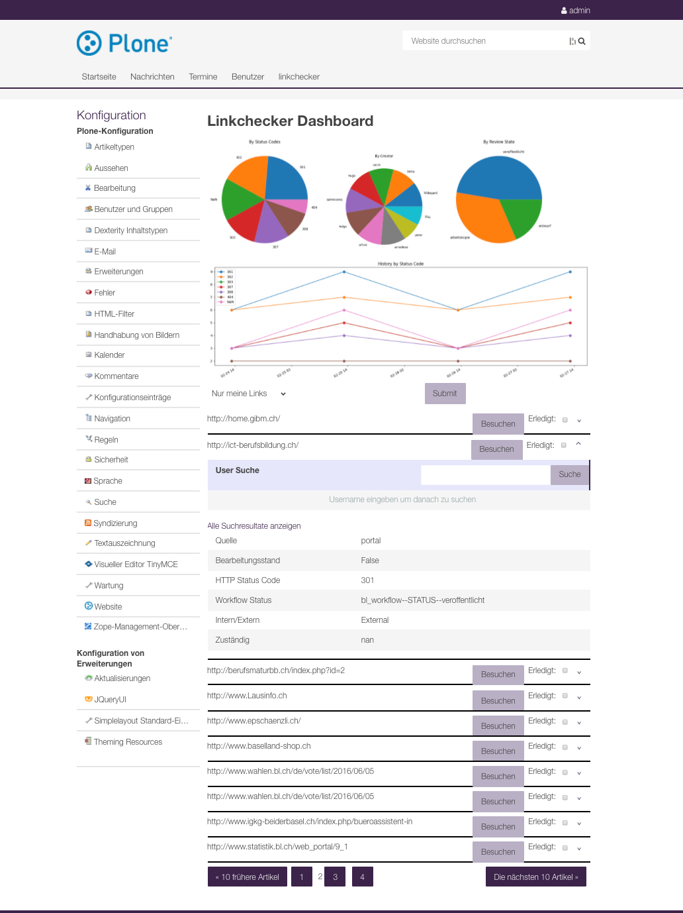

ftw.linkchecker
---------------
.. contents:: Table of Contents

Introduction
============

``ftw.linkchecker`` is an add-on for Plone installations. It is designed to be run
as a cronjob regularly to find and report broken links and references within Plone sites.

If it's installed with its profile it comes with a management dashboard as
well.

How it works
****************

- The settings file is inspected and the information gets extracted per site.
- For each Plone site (whether configured or not) in the zope instance:
    - All fields possibly containing links are analysed and link/relation like
      strings are collected and stored as link objects with some additional info.
    - A check is done for each link/relation whether they are broken.
    - A report is generated in an Excel sheet.
    - The report is sent to the email addresses configured.
    - If a valid upload location is provided, the file is stored there additionally.

Important note
**************

You should be careful not to activate this script as a
cronjob in environments where the ZEO server could be legitimately
down for long periods (e.g. Staging / Test servers) as it could lead
to locking up/crashing the entire machine.

See non-production-info_ for more information.

Compatibility
-------------

Plone 4.3.x

Installation
============

- Add the package to your buildout configuration:

::

    [instance]
    eggs +=
        ...
        ftw.linkchecker

Settings
========

A JSON settings file is required (see below for an example).
The following options can be configured in the settings file per platform:

- emails of the platforms administrator (the ones who gets the report)
- base URI (domain where the platform is configured - it will be prepended to the report)
- timeout in seconds (how long the script waits for each external link before
  continuing if the page does not respond).
- upload_location can be left empty.
  If set, it should be a path to a Plone container type (such as a Folder or a ``ftw.simplelayout`` file listing
  block) where the report `File` will additionally be uploaded.

::

    {
      "/plone1": {
        "email": ["first_site_admin@example.com", "first_site_keeper@example.com"],
        "base_uri": "http://example1.ch",
        "timeout_config": "1",
        "upload_location": "/content_page/my_file_listing_block"
      },
      "/folder/plone2": {
        "email": ["second_site_admin@example.com"],
        "base_uri": "http://example2.ch",
        "timeout_config": "1"
      }
    }

If the linkchecker dashboard is installed (profile installed) the upload
location has to be configured in the registry for each policy. It has to be the
same one configured in the above json configuration.
The registry entry defaults to ``linkchecker/reports`` if not configured
(relative to the current Plone Site).

::

    <record name="ftw.linkchecker.dashboard_storage">
        <field type="plone.registry.field.TextLine">
            <title>Storage of the linkchecker dashboard.</title>
            <required>False</required>
        </field>
        <value>linkchecker/reports</value>
    </record>

Usage
=====

CLI Application
***************

Run command for ftw.linkchecker.

::

    bin/instance check_links /path/to/settings.json [-l /path/to/logfile.log] [-p processes]

- The first (positional) argument is the path to the settings file.
- The second (optional) argument (prefixed with ``-l`` or ``--logpath``) is
  the path to a logfile (which was created in advance).
- The third (optional) argument (prefixed with ``-p`` or ``--processes``) is
  the maximal number of processes spawned for the head requests.

Dashboard
*********

The dashboard adds a view at ``platform/@@linkchecker-dashboard``.

The dashboard (see image above) adds four graphs summarizing the most important
info about the broken links (which status codes are affected, who is
responsible for the broken relations, what is the workflow state of the
content and how did it evolve over the last reports).

Below the graphs the broken relations are listed. Further information can be
seen opening the detail view. The links can be assigned to a user or checked as
done.

The dashboard implements a filter for the links. The filter arguments accepted
for each filter are:

- ``My Links only``: No arguments accepted.
- ``HTTP Status Code``: Number of the status code e.g. ``404``
- ``Is Done``: ``True``, ``true``, ``1`` or ``False``, ``false``, ``0``
- ``Workflow State``: The exact workflow states name
- ``Internal/External``: Either ``Internal`` or ``External``

Development
===========

1. Fork this repo
2. Clone your fork
3. Shell: ``ln -s development.cfg buildout.cfg``
4. Shell: ``python bootstrap.py``
5. Shell: ``bin/buildout``

Run ``bin/test`` to test your changes.

Or start an instance by running ``bin/instance fg``.

Links
=====

- Github: https://github.com/4teamwork/ftw.linkchecker
- Issues: https://github.com/4teamwork/ftw.linkchecker/issues
- Pypi: http://pypi.python.org/pypi/ftw.linkchecker

Copyright
=========

This package is copyright by `4teamwork <http://www.4teamwork.ch/>`_.

``ftw.linkchecker`` is licensed under GNU General Public License, version 2.

Additional Notes
================

.. _non-production-info:

Do not run in non-production
****************************

In development bin/instance is (usually) the Plone server.
In other setups, bin/instance is a so called ZEO client.
A ZEO client will, instead of directly opening a Data.fs,
access the ZEO server over the network.
In our setups, this is wired up via ftw-buildouts.

Now, if the ZEO server cannot be reached (not running,
network issues, misconfiguration, ...), the ZEO client will
sleep for a bit, and try to reconnect.
By default, it does this in an infinite loop and it will
try to reconnect to the mothership until the end of time.
For the regular instances (ZEO clients) running in supervisor,
this is the ideal behavior: If the ZEO server temporarily cannot
be reached, the clients will try to reconnect all by themselves.
If the ZEO server comes back up again, the system will fix itself without
any need for intervention.

However, when using bin/instance from cronjobs,
this can lead to a problem. If at any given time the ZEO server
cannot be reached (for whatever reason - accidentally stopped, misconfigured,
network problems, ...), the client invoked by the cron job will attempt to
reconnect forever. Therefore that script will never terminate
(and return control to the shell). Instead it will keep running,
and the next day (or whenever the cron job gets executed the next time),
a new instance will be invoked, which will also hang.

So every night another "hanging" process that's stuck in an infinite
loop will be added. These can accumulate quickly, and lead to server-wide
resource issues. One might hit limits like max max number of open file
descriptors, number of processes per user, server memory, high load,
max number of open sockets, ... If a situation like this ever happens,
it's basically a matter of time until that entire server goes down (unless
someone recognizes the issue and fixes it).

Therefore there's at least a caveat when configuring cron jobs to run scripts
like this. It doesn't necessarily mean it shouldn't be done, but it comes with
an operational risk that's somewhat tricky to manage.
